# UPLIFTLY - System Design Document

> **AI-Powered Creator Platform for Video Content Analysis**

---

## 📖 Product Overview

UPLIFTLY is a comprehensive web platform that empowers content creators to analyze and improve their video content using artificial intelligence. By providing actionable insights before publishing, UPLIFTLY helps creators maximize engagement, reach, and overall content quality.

### Key Value Propositions
- **AI-Driven Insights**: Automated analysis of video content
- **Pre-Publish Optimization**: Improve content before it goes live
- **Data-Driven Decisions**: Analytics to guide content strategy
- **Time Efficiency**: Reduce manual review time significantly

---

## 🎯 Problem Statement

### The Challenge
Content creators face several challenges in today's competitive digital landscape:

1. **Content Quality Uncertainty**: Creators lack objective metrics to evaluate content before publishing
2. **Time-Consuming Reviews**: Manual content review is slow and inconsistent
3. **Missed Optimization Opportunities**: Without AI assistance, subtle improvements go unnoticed
4. **Engagement Prediction Difficulty**: Hard to predict how audiences will respond
5. **SEO Optimization Gap**: Title, description, and thumbnail optimization requires expertise

### Impact
- Lower engagement rates
- Reduced audience growth
- Inconsistent content quality
- Wasted production resources

---

## 💡 Proposed Solution

### PROCREATE Platform

A unified platform that combines:

```
┌────────────────────────────────────────────────────────────────┐
│                    PROCREATE SOLUTION                          │
├────────────────────────────────────────────────────────────────┤
│                                                                │
│  ┌──────────────┐   ┌──────────────┐   ┌──────────────┐       │
│  │   ANALYZE    │   │   OPTIMIZE   │   │   PUBLISH    │       │
│  │              │   │              │   │              │       │
│  │ • Upload     │──►│ • Get AI     │──►│ • Apply      │       │
│  │ • Process    │   │   Suggestions│   │   Changes    │       │
│  │ • Score      │   │ • Compare    │   │ • Track      │       │
│  └──────────────┘   └──────────────┘   └──────────────┘       │
│                                                                │
└────────────────────────────────────────────────────────────────┘
```

### Core Solution Components
1. **Secure User Authentication**: JWT-based authentication with bcrypt password hashing
2. **Intuitive Dashboard**: Real-time analytics and content management
3. **Video Upload System**: Drag-and-drop interface for easy uploads
4. **AI Analysis Engine**: Deep learning models for content analysis (future)
5. **Recommendation System**: Actionable improvement suggestions (future)

---

## 🏛️ System Architecture Overview

### High-Level Architecture

```
                                   ┌─────────────────┐
                                   │    CDN/Cache    │
                                   │   (CloudFlare)  │
                                   └────────┬────────┘
                                            │
                    ┌───────────────────────┴───────────────────────┐
                    │                                               │
           ┌────────▼────────┐                           ┌──────────▼──────────┐
           │    Frontend     │                           │      Backend        │
           │    (Next.js)    │◄─────── REST API ────────►│     (FastAPI)       │
           │    Port 3000    │                           │     Port 8000       │
           └─────────────────┘                           └──────────┬──────────┘
                                                                    │
                         ┌──────────────────────────────────────────┼──────────┐
                         │                                          │          │
                ┌────────▼────────┐                      ┌──────────▼──────┐   │
                │   PostgreSQL    │                      │   File Storage  │   │
                │   (Database)    │                      │   (S3/Local)    │   │
                │   Port 5432     │                      └─────────────────┘   │
                └─────────────────┘                                            │
                                                                               │
                                                               ┌───────────────▼───┐
                                                               │   AI/ML Service   │
                                                               │   (Future)        │
                                                               └───────────────────┘
```

### Request Flow

```
User Request → Frontend → API Gateway → Backend Router → Service Layer → Database
                                              ↓
                                       Response ← Data Processing ← Query Result
```

---

## 🧩 System Component Explanation

### 1. Frontend (Next.js 14)

**Purpose**: User interface and client-side logic

| Component | Responsibility |
|-----------|----------------|
| `/app/page.tsx` | Landing page with hero section |
| `/app/login/page.tsx` | User authentication |
| `/app/signup/page.tsx` | User registration |
| `/app/dashboard/page.tsx` | Main user dashboard |
| `/services/api.ts` | API communication layer |

**Key Features**:
- Server-side rendering for SEO
- App Router for optimized routing
- CSS Modules for scoped styling
- Responsive design for all devices

### 2. Backend (FastAPI)

**Purpose**: Business logic and API endpoints

| Module | Responsibility |
|--------|----------------|
| `main.py` | Application entry point, CORS, routes |
| `config.py` | Environment configuration |
| `database.py` | Database connection management |
| `models/` | SQLAlchemy ORM models |
| `schemas/` | Pydantic validation schemas |
| `routes/` | API endpoint definitions |
| `services/` | Business logic implementation |

**Key Features**:
- Automatic OpenAPI documentation
- Async request handling
- Dependency injection
- JWT authentication middleware

### 3. Database (PostgreSQL)

**Purpose**: Persistent data storage

**Schema Design**:
```sql
Table: users
├── id (PK, SERIAL)
├── name (VARCHAR(100))
├── email (VARCHAR(255), UNIQUE)
├── password (VARCHAR(255))  -- bcrypt hashed
├── is_active (BOOLEAN)
├── created_at (TIMESTAMP)
└── updated_at (TIMESTAMP)
```

### 4. Authentication Service

**Purpose**: Secure user authentication

```
┌─────────────┐       ┌─────────────┐       ┌─────────────┐
│   Client    │──────►│   Server    │──────►│   Database  │
│             │       │             │       │             │
│  Login Form │       │  Validate   │       │  User Data  │
│             │◄──────│  Generate   │◄──────│             │
│  JWT Token  │       │    JWT      │       │  Verify     │
└─────────────┘       └─────────────┘       └─────────────┘
```

**Security Measures**:
- Bcrypt password hashing (cost factor: 12)
- JWT with configurable expiration
- CORS protection
- SQL injection prevention via ORM

---

## 🔄 Workflow Description

### User Registration Flow


### Authentication Flow


### Dashboard Access Flow

```mermaid
sequenceDiagram
    participant U as User
    participant F as Frontend
    participant B as Backend

    U->>F: Navigate to dashboard
    F->>F: Check auth token
    alt Token exists
        F->>B: GET /dashboard + token
        B->>B: Validate token
        B-->>F: Dashboard data
        F-->>U: Display dashboard
    else No token
        F-->>U: Redirect to login
    end
```



---

## ⚙️ Design Considerations

### Security

| Aspect | Implementation |
|--------|----------------|
| Password Storage | bcrypt with salt |
| Authentication | JWT with HS256 algorithm |
| Token Expiry | 30 minutes (configurable) |
| CORS | Restricted to frontend origin |
| Input Validation | Pydantic schemas |

### Scalability

| Consideration | Approach |
|---------------|----------|
| Horizontal Scaling | Stateless API design |
| Database | Connection pooling (10 connections) |
| Caching | Ready for Redis integration |
| File Storage | S3-compatible storage ready |

### Performance

| Optimization | Implementation |
|--------------|----------------|
| API | Async endpoints |
| Database | Indexed queries |
| Frontend | Next.js SSR + code splitting |
| Assets | Static file optimization |

### Maintainability

| Practice | Implementation |
|----------|----------------|
| Code Structure | Modular architecture |
| Type Safety | TypeScript + Pydantic |
| Documentation | Auto-generated OpenAPI |
| Testing | Pytest + Jest ready |

---

## 🚀 Future Enhancements

### Short-term (3-6 months)
1. **Video Upload Module**: S3 integration for video storage
2. **Basic AI Analysis**: Integration with video analysis APIs
3. **Email Notifications**: User engagement emails
4. **Password Reset**: Forgot password functionality

### Medium-term (6-12 months)
1. **Advanced ML Models**: Custom trained models for content scoring
2. **Real-time Processing**: WebSocket for live analysis updates
3. **Collaborative Features**: Team accounts and sharing
4. **Analytics Dashboard**: Comprehensive content performance metrics

### Long-term (12+ months)
1. **Mobile Applications**: iOS and Android apps
2. **API Platform**: Public API for third-party developers
3. **Enterprise Features**: SSO, audit logs, compliance
4. **AI Content Generation**: AI-assisted content creation tools

---

## 📊 Technical Metrics

### Performance Targets

| Metric | Target | Measurement |
|--------|--------|-------------|
| API Latency (p95) | < 200ms | Application monitoring |
| Frontend LCP | < 2.5s | Lighthouse |
| Database Query | < 50ms | Query analyzer |
| Uptime | 99.9% | Health checks |

### Capacity Planning

| Component | Initial | Scaled |
|-----------|---------|--------|
| Concurrent Users | 100 | 10,000+ |
| Requests/sec | 50 | 5,000+ |
| Storage | 50 GB | 10+ TB |
| Database Connections | 20 | 200+ |

---

## ✅ Conclusion

UPLIFTLY represents a modern, scalable solution for content creators seeking to leverage AI for content optimization. The MVP delivers:

1. **Secure Authentication**: Industry-standard JWT + bcrypt implementation
2. **Clean Architecture**: Separation of concerns with modular design
3. **Premium UI/UX**: Modern, responsive interface with smooth animations
4. **Docker-Ready**: One-command deployment with Docker Compose
5. **Extensible Design**: Ready for future AI/ML integration

The platform is built with growth in mind, using technologies that scale from hackathon prototype to production system.

---

*Document Version: 1.0.0 | Last Updated: February 2026*
